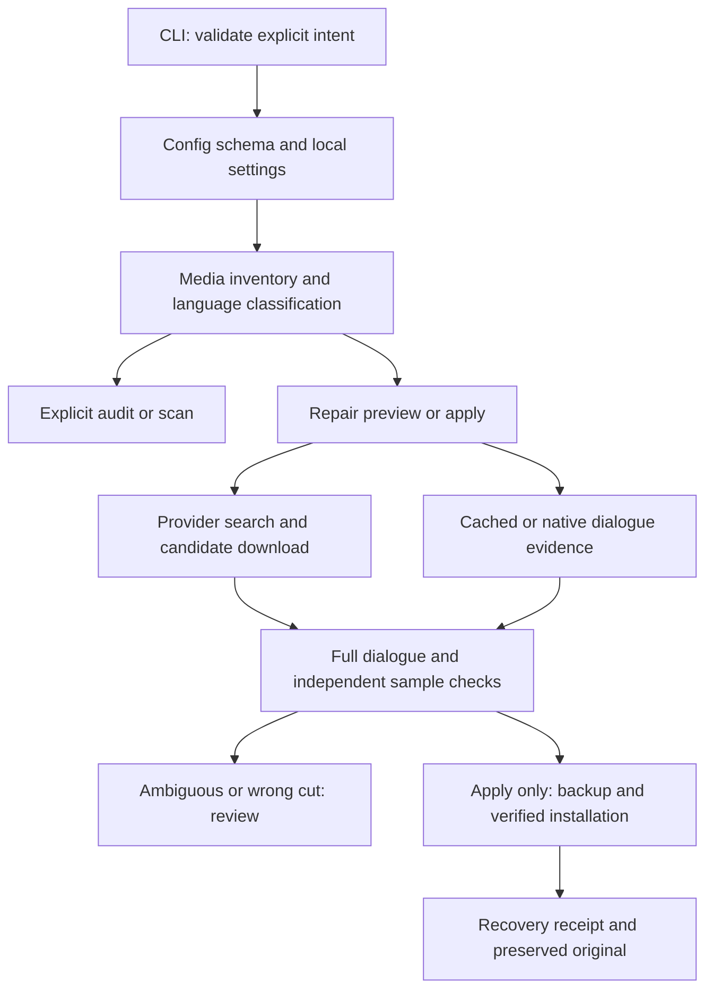

# Architecture and boundaries

The public interface is `subtitle-maintain` (or the compatibility wrapper
`subtitle-maintain.py`). Standalone utilities remain available from the checkout.

| Module | Responsibility |
| --- | --- |
| `cli.py` | Argument validation, mode selection, locking, progress and reports |
| `script_config.py`, `config_schema.py` | Config discovery, path resolution, key/type/range validation |
| `doctor.py` | Local read-only dependency checks; no tool execution or network |
| `media.py` | File inventory, subtitle classification, audio selection |
| `workflow.py` | Coordinate evidence and processing, without weakening verification |
| `providers.py`, `bazarr_bridge.py` | Provider process boundary, quotas, authentication and transport recovery |
| `native.py`, `native_worker.py` | Transcript caching and short-lived native inference |
| `subtitles.py`, `validation.py`, `drift.py` | Parsing, dialogue checks, opt-in affine timing proposals |
| `common.py`, `housekeeping.py` | Backup/install primitives and explicit quarantine/restore |
| `bitmap_ocr.py`, `audio_tags.py` | Separate OCR and explicitly requested metadata operations |

## Deliberate choices

- The default is non-destructive. Bare entry points show help; mutation permission
  comes from CLI flags, never config. A repair preview can still download and
  transcribe into local state. `--scan-only` avoids those operations.
- State and content-addressed backups live outside source control. Existing
  transcript caches reduce repeated work, while fingerprints reject stale inputs.
- Workers separate provider/runtime dependencies from the standard-library core.
  Optional integrations are installed only when needed.
- File replacement is staged and checked, but this is not a distributed filesystem
  transaction. Other programs can still modify media concurrently.
- Embedded English text is trusted by policy; metadata trust is distinct from
  dialogue verification. Wrong cuts and ambiguous language remain review cases.
- Config filesystem settings and processing policy are separate concerns. The
  optional `policy` section is normalized once; flat legacy policy keys still work.

## Scope

The supported general entry point handles English subtitle maintenance. The
EastEnders and QI scripts encode show-specific assumptions and remain specialist
utilities. Native MLX inference requires Apple Silicon. CI tests core behavior on
Linux and macOS without testing a real model, OCR engine, or provider account.
